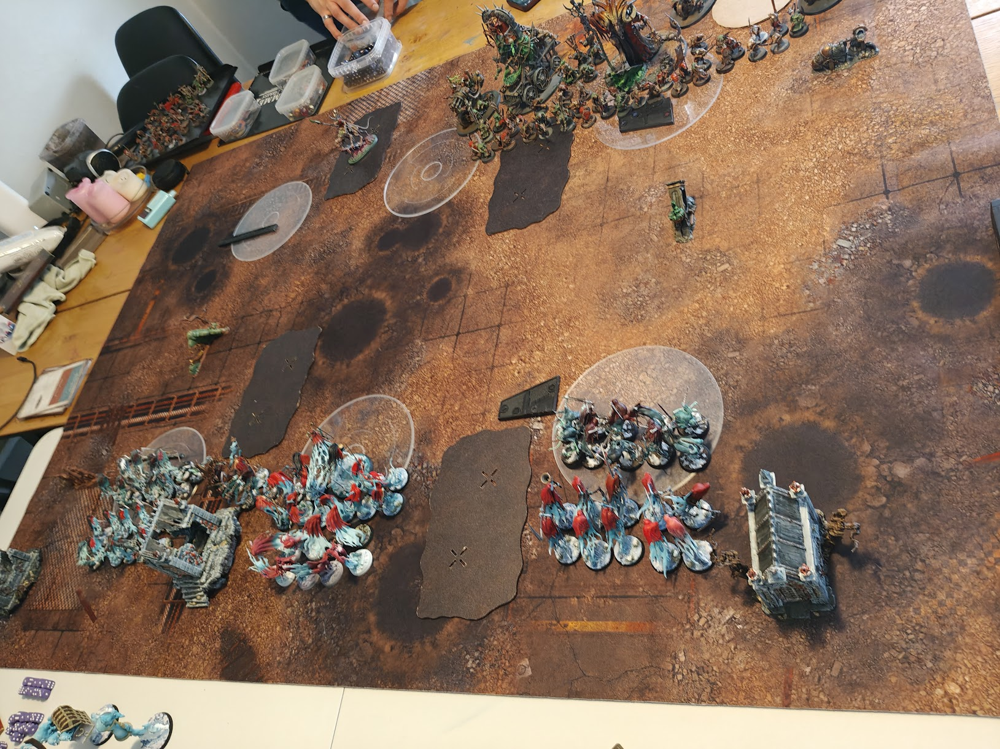
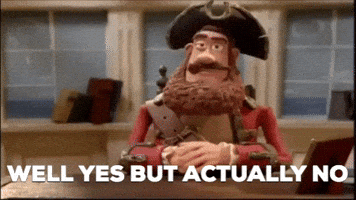
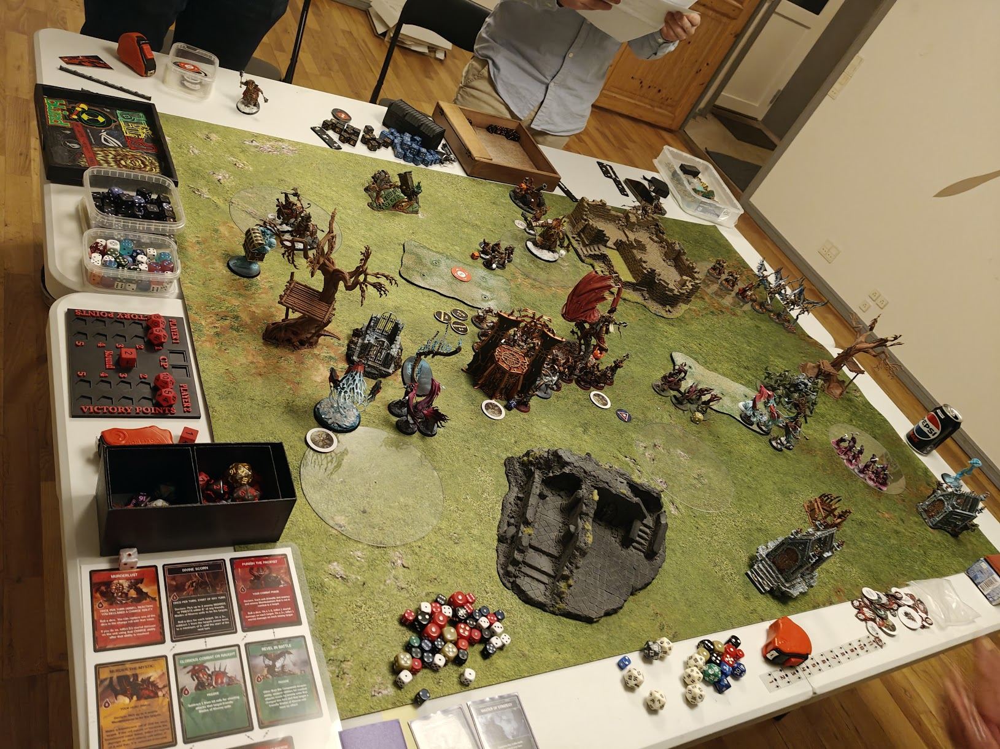
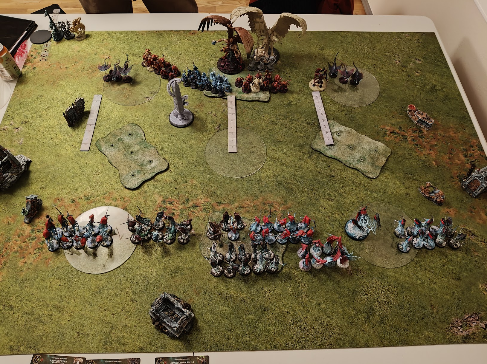
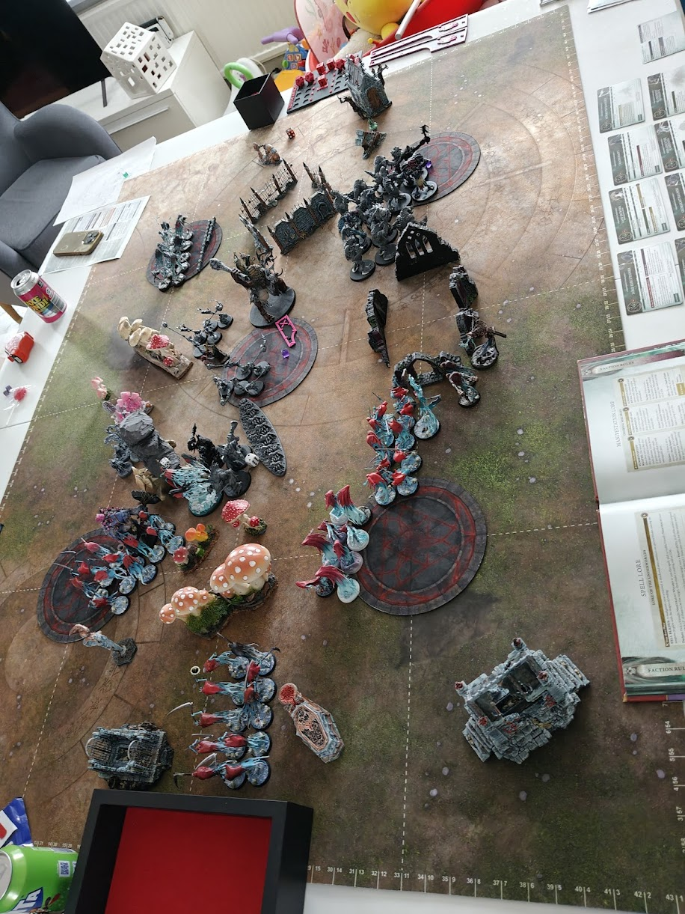

---
# ─── Required ────────────────────────────────────────────────
title: '6 Months and 16 Games - Part 1'
date: 2026-07-14T13:21:30+02:00
draft: true                 
description: "The first part of the 6 months of Age of Sigmar, The Nighthaunt"
tags: ["wargaming"]
stats: ["One army painted", "Loads of grey left"]
---

Do you like Rocky? Then this post is for you, its my training montage spanning 6 months where I got to play 16 games. I lost a lot and I will continue to do so. Learning is hard, but my god, this game is also fun!

But its not the whole montage in one go, it will cover my 4 first games with my friendly ghosts.



> BEHOLD! MY ARMY IS PAINTED

## You have to learn to crawl, before you can run

The first game didn't scare me away, it fueled me. Ready to rumble and I was sure, victory was around the corner!

| # | Matchup | Score | Date |
|---|---------|-------|------|
| 1 | Nighthaunt vs Helsmiths | 24 - 44 | 17 dec |
| 2 | Nighthaunt & Khorne vs Stormcast & Helsmiths | 64 - 66 | 14 Jan |
| 3 | Nighthaunt vs Skaven | 24 - 36 | 22 feb |
| 4 | Nighthaunt vs Tzeenth | 60 - 55 | 25 feb |
| 5 | Nighthaunt vs Gitz | Gitz won (no scores) | 3. apr |

6 games in my carrier so far and 1 victory. I WON A GAME WUHU! Granted 1 of the games was a 2 vs 2, but that was also super fun to play.


## The Art of War

*Did I learn not to charge head first into the enemy screen?*



So honestly the games are quite a while back and I can't recall all the details. I have taken loads of pictures (good job!) to document and hopefully learn from them and that is what we are trying to do now.

In game #1 I did the same as in my debut charged my whole army forward and lost the game pretty quickly.[^1] 

In game #2 I stood back and my comrade the Khorne player moved up to the middle. The Stormcast rushed to meet him and the had a glorious battle in the center. Whilst I took objectives and the Chaos dwarfs shot us to pieces.



In game #3 I tried the opposite strategy. Stand my ground. Send one unit. Needless to say, that didn't work *either*. In hindsigth I can see there is no benifit to send one unit to the death without a goal. Stratitic thought is clearly missing from that play. Needless to say I got devout by 80 clan rats or something ridiculess like that haha 


In game #4 came my very first victory. AT LAST. 

This game I wasn't so focused on fighting but more on holding objectives. My units abilties also worked great against him. My Harridans anti healing prevented a lot of his recursion with his horrors and my bladegheist's anti charge ability worked more than it should, really helping me keep the center. Attrition was something this army does well.[^2]



In game #5 I played against Gitz and unfortunately I didnt get to capture the points. But I am preeeeetty sure I lost.


## Lessons learned

I was fortunate to play a lot of different armies with my Nighthaunt. I didn't change my list through the games. I wanted to play the same list consistenly before I started to change it.

```
The Friendly Ghosts

Nighthaunt
Quicksilver Gheists (40)
Drops: 3
Spell Lore - Lore of the Underworlds
Manifestation Lore - Infernal Sorceries

General's Regiment
Lady Olynder, Mortarch of Grief 
• General
Myrmourn Banshees 
• Reinforced
Bladegheist Revenants 
Bladegheist Revenants 

Regiment 1
Krulghast Cruciator 
• Ruler of the Spectral Hosts 
Dreadscythe Harridans 
Dreadscythe Harridans 
Grimghast Reapers 

Regiment 2
Guardian of Souls
Chainghasts 

Faction Terrain
Nexus of Grief
```

Something like this - with a few variantion along the way. I feel like this gives me a better reviewing data, since it was the same amry i played and cannot blame luck or dice or anythung like that. 

The two main things I learned: 

> LESSON #1 : Don't Charge headlessly into shooting armies with screens

> LESSON #2 : You win by scoring points, not by fighting

So no ugabuga got it. Stand on circles, got it.

What I liked about my army:
- Quite resilient, 6+5++ etheral is quite good + Krulghast's aura made it pretty hard to just wipe me off the board (It happened a lot, but it wasn't easy mind you)
- Mobility 8" fly army wide is pretty good
- Model recursing. If my opponent finally got a good chuck down of a unit. Then the Ruler of the Spectral Host and the Ghost Houses gave them back.

What I didn't quite like:
- As destructive as a pillow. Killing things was super hard and to be honest. That is kinda one of the fun parts of this game.
- "On a 3+ you.." a lot of my abilities are slot machines.


## Nighthaunt til we die?

I love these model, but I need to try something that actually can kill things. Which is what we will explore in part 2.

[^1]: Don't Charge headlessly into shooting armies with screens
[^2]: You win by scoring points, not by fighting

