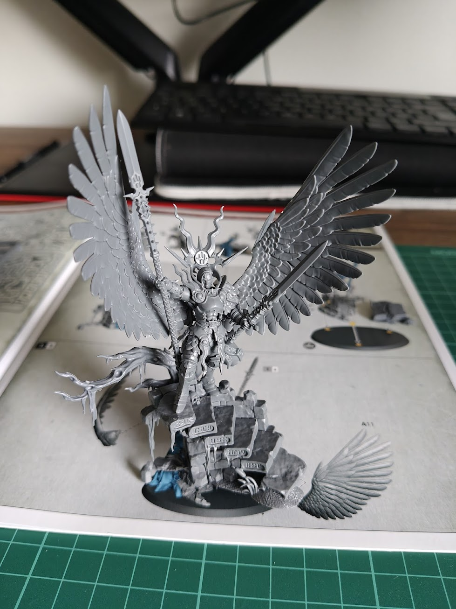
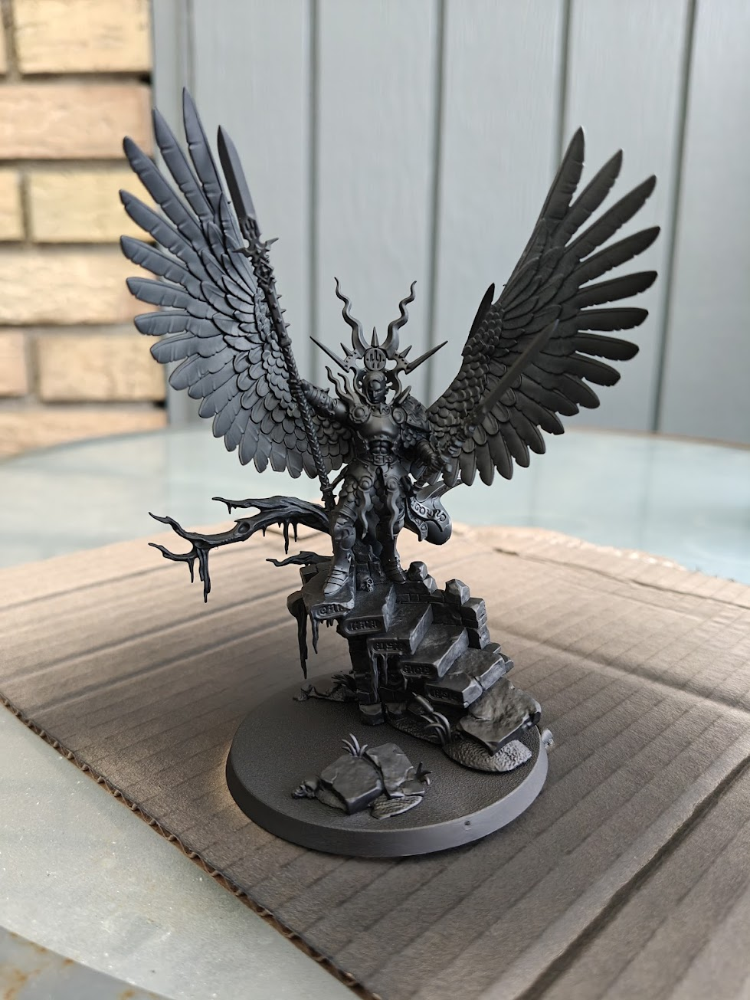
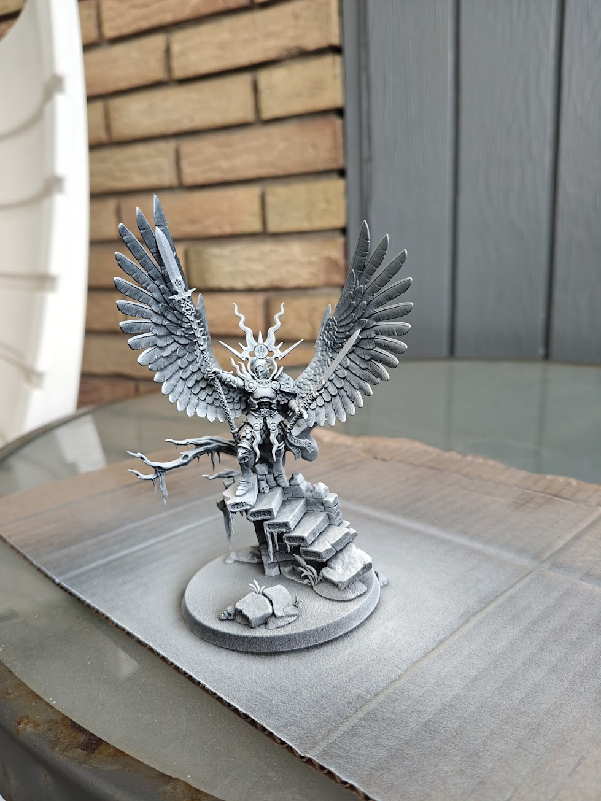
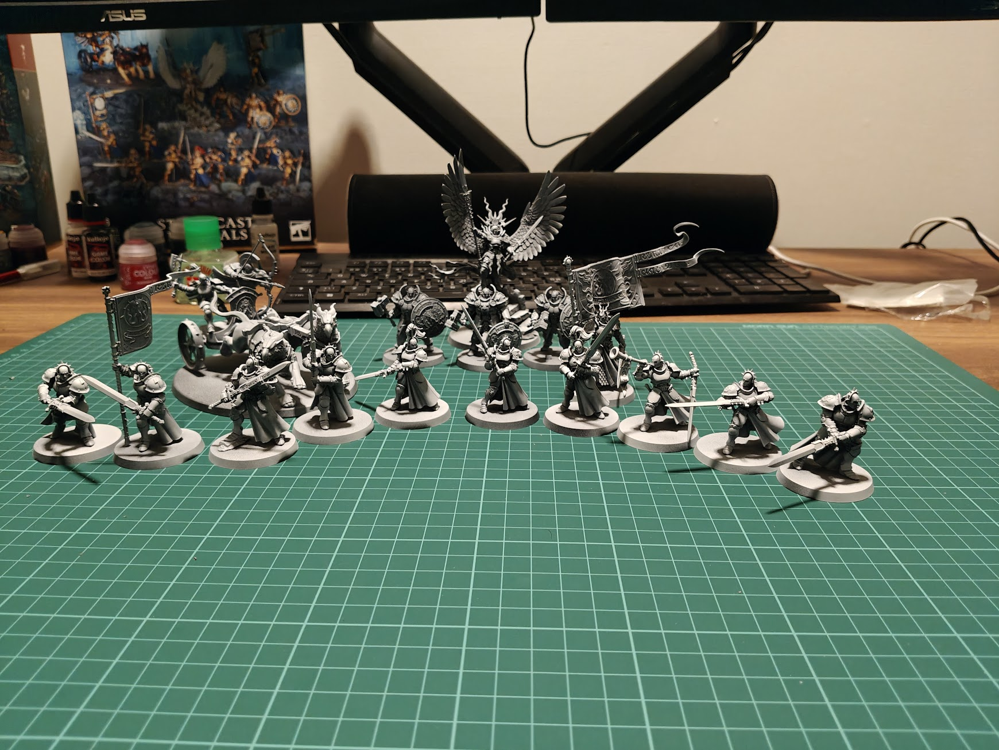
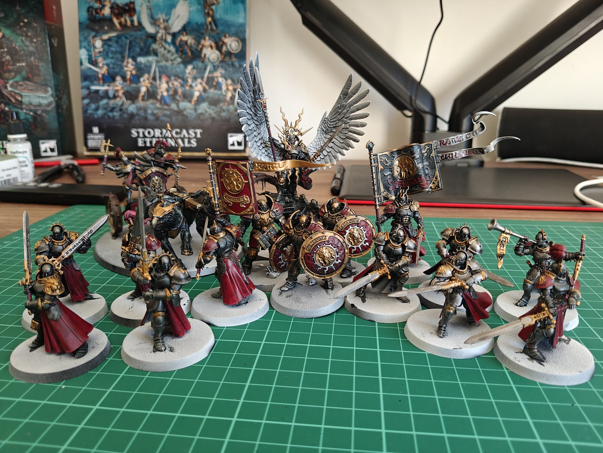

---
# ─── Required ────────────────────────────────────────────────
title: 'Yndrastas Spearhead'
date: 2026-07-04T13:55:54+02:00
draft: false                 
description: "The results of my first venture into Warhammer: Age of Sigmar"
tags: ["wargaming"]
stats: ["16 models painted", "red scheme, obviously"]
---

<!--
Writing notes (delete this block before publishing):

  Heading  — the title above is already the page <h1>, so DON'T start the body
             with `#`. Jump straight into text, or open with a `## Section`.

  Images   — drop image files in THIS folder, reference them by filename:
             

  Quotes   — `> quoted line` renders as the oxblood-bordered callout.

  Statstrip — optional honest-numbers strip at the end of the post. Shortcode
              form is a less-than sign wrapped in double curly braces, e.g.
              statstrip "progress: lessons 4/8 · boxes 250/250 · dragons 1/∞"
              (see any existing post, or layouts/shortcodes/statstrip.html)
-->

<!-- Hook (1–2 sætninger): Hvad skete der? Sig det med det samme. "I finished the 250 box challenge last night." -->

Are you excited to see what this Warhammer stuff is and what I am doing with it? No? ... Well too bad for you, because I am going to yap about in here now - with pictures of how it went.

<!-- Kontekst (1 kort afsnit): Hvorfor gjorde du det, og hvor kom du fra? Link til tidligere indlæg i stedet for at genfortælle. -->

## Why Warhammer? 
Well, before I started to look for another hobby I spent my Tuesday evenings playing Magic the Gathering with the local community, a game that I really love. Unfortunately the game is progressing in a way that makes me not enjoy it anymore. Which naturally made me think that if I do not enjoy it anymore, I shouldn't spend my time on it, so I put my decks on the shelf and started to look for something else and what I found was **Warhammer: Age of Sigmar**

My cousin is an active player in the local community and I texted him, inquiring about how the game was like and so forth and he told me about the different settings, 40K, Old World and Age of Sigmar. AoS was the most appealing to me so I wanted to try that. He told me to get a Spearhead box of the faction I found the coolest and that's how it started.

<!-- Kernen (2–4 afsnit): Den ene ting du lærte, opdagede eller kæmpede med. Vær specifik — vis eksemplet, fejlen, billedet. -->

## Yndrasta, the monster Hunter
I settled on Yndrasta's spearhead. The Stormcast, the posterboys of the setting. Sigmar's chosen to fight the forces of Chaos! Oh boys I had no idea how deep this rabbit hole was! I had to get loads of supplies: clippers, hobby knife, glue, paint (and a primer! What the f... is a primer) and of course, the models themselves.

I started assembling Yndrasta herself

Gave her a coat of black primer and a white zenithal

 Thought it already looked gorgeous and assembled the rest and gave them the same zenithal treatment.
 

 I found a little guide on youtube on how to paint Stormcast in a certain colorscheme involving red and I wanted to replicate that: https://www.youtube.com/watch?v=fFfoSOHd1vU&list=PLC1Yp2FjnVpZtToM_LwYKzQue23R2NFDQ

 I started painting and this was the result

 

 LOOK HOW FREAKING COOL IT LOOKS! AND I PAINTED THAT! ME! haha. 

<!-- Ærligt status-tjek (1 afsnit): Hvad virkede ikke? Hvad er du stadig i tvivl om? (Det er dét, der gør loggen værd at genlæse.) -->

## I was hooked

I was super surprised that I actually really liked painting these models. I thought I would hate it, I only wanted to play the game, but I was pleasantly surprised that the hobby side also was super fun. And looking at my backlog of posts I want to write, it is clear where most of the content is from, it's Warhammer.

<!-- Næste skridt (1–2 sætninger): Konkret og lille. "Next up: lesson 4, texture." Aldrig et vagt "we'll see!" -->

## What's next?

Later this day I will write another post about the second (oh you read that correctly, my *second*) spearhead, what faction is it? Will i pivot or stay with the same faction? We'll see in the next one. Take care and my Sigmar protect you!

