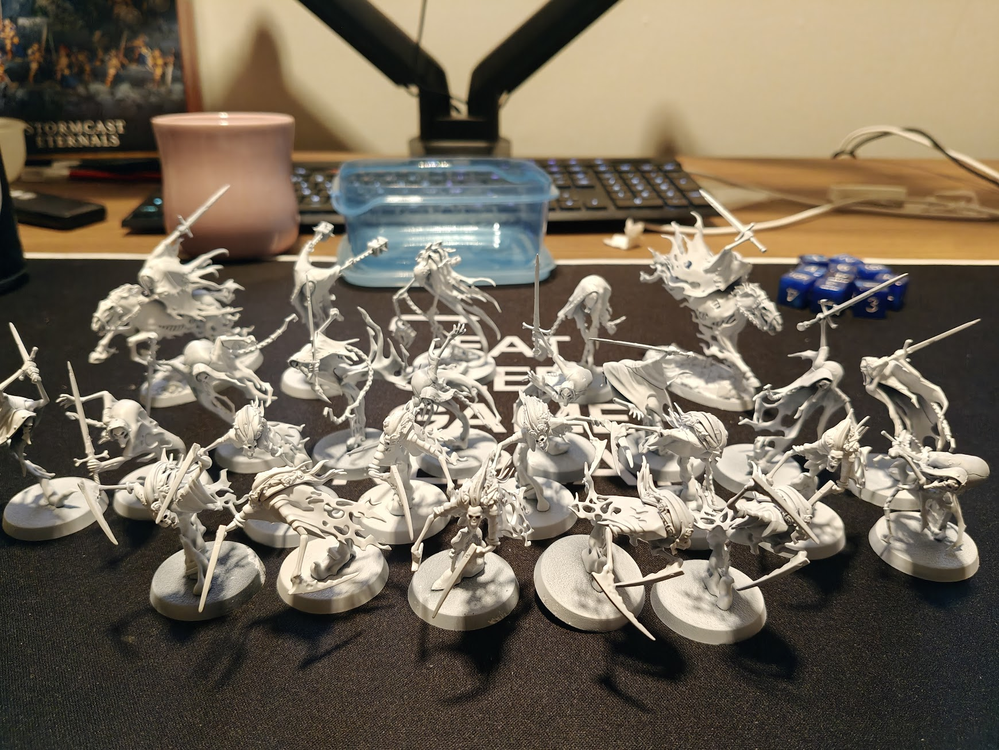
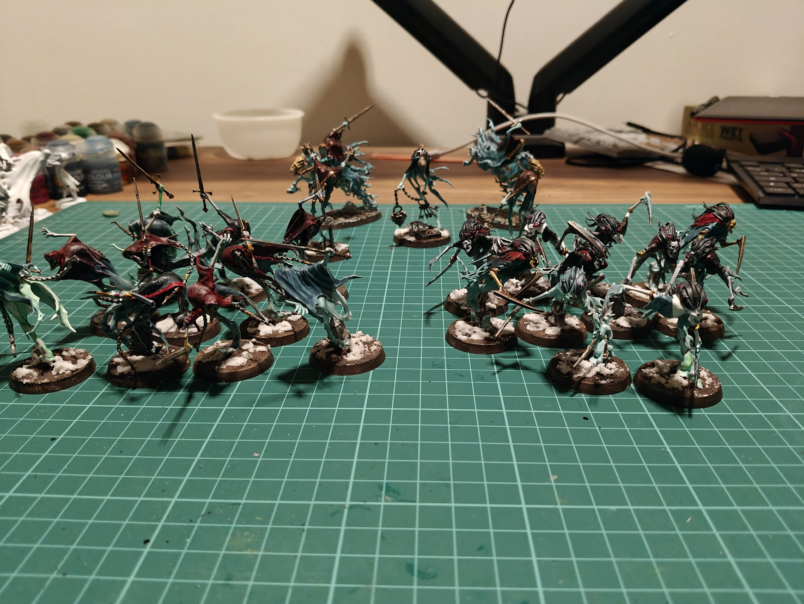

---
# ─── Required ────────────────────────────────────────────────
title: 'Cursed Shacklehorde'
date: 2026-07-04T22:23:23+02:00
draft: false                
description: "The second spearhead I bought, because Nighthaunts are so damn cool"
tags: ["wargaming"]
stats: ["41 models painted", "Two Spearheads"]
---

<!--
Writing notes (delete this block before publishing):

  Heading  — the title above is already the page <h1>, so DON'T start the body
             with `#`. Jump straight into text, or open with a `## Section`.

  Images   — drop image files in THIS folder, reference them by filename:
             

  Quotes   — `> quoted line` renders as the oxblood-bordered callout.

  Statstrip — optional honest-numbers strip at the end of the post. Shortcode
              form is a less-than sign wrapped in double curly braces, e.g.
              statstrip "progress: lessons 4/8 · boxes 250/250 · dragons 1/∞"
              (see any existing post, or layouts/shortcodes/statstrip.html)
-->

<!-- Hook (1–2 sætninger): Hvad skete der? Sig det med det samme. "I finished the 250 box challenge last night." -->

So you thought I was sticking to the Stormcast Eternals huh? NOPE, ghosts are freaking cool and I need to play em!

<!-- Kontekst (1 kort afsnit): Hvorfor gjorde du det, og hvor kom du fra? Link til tidligere indlæg i stedet for at genfortælle. -->

## From the souls serving the good, to the souls enslaved by Nagash

There are 24 factions in Age of Sigmar. Picking one between all those cool candidates is a hard choice. I was torn between several factions: Sylvaneth, Daughters of Khaine, Lumineth Realm-Lords,
and Nighthaunt and Nighthaunt won, those bedsheets are really cool and it was a lot more models than the Stormcast I picked the last time.

<!-- Kernen (2–4 afsnit): Den ene ting du lærte, opdagede eller kæmpede med. Vær specifik — vis eksemplet, fejlen, billedet. -->
## Nighthaunt! Assemble!
I started with the same approach as I did in Yndrasta's Spearhead, I assembled them and this time I wanted to try and prime them white and not zenithal.

As a beginner I didn't really know which method to go for so I wanted to experiment as well to see where it would take me. This time I didn't find a single youtube video with one scheme, I tried loads of different recipes out.

<!-- Ærligt status-tjek (1 afsnit): Hvad virkede ikke? Hvad er du stadig i tvivl om? (Det er dét, der gør loggen værd at genlæse.) -->
## Consistency is key, but experimentation took over
Now, since I tried a lot of different things the spearhead came out a little what can we say, noncoherent? The Bladegheist has different colors model to model, same as the Harridans. As I settled on a scheme I liked the Harrows, Chainghasts and the Spirit Torment came out more coherent with a similar scheme. So for the next spearhead I will definitely settle on a color scheme to make the army look better. 

<!-- Næste skridt (1–2 sætninger): Konkret og lille. "Next up: lesson 4, texture." Aldrig et vagt "we'll see!" -->
## Next Spearhead? Will you keep buying spearhead boxes?
Well yes, but that is not what is up next. Tomorrow I will show you which spearhead will lay the foundations for my first 2000 point army. See you tomorrow!


