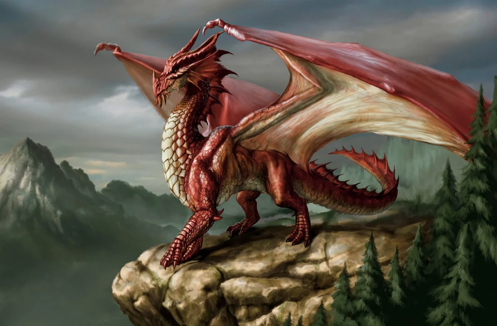
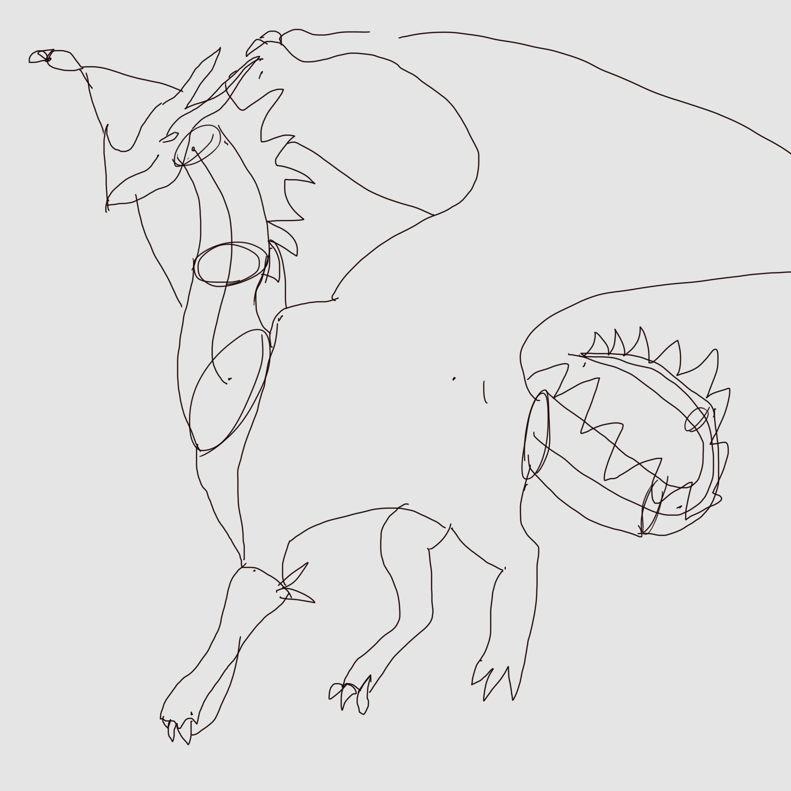

# An attempt to draw a dragon from reference.

Here is the beautiful reference I am using

 

*(Got the image from https://kingarthur.fandom.com/wiki/Dragons - I can't find the author of the image, would love to credit you, will do when I figure out who you are!)*

I bought a One by Wacom, or whatever its called, its a screen-less drawing tablet and I need to learn how to use it. Therefore I wanted to draw a dragon and share it here!

## Behold the beauty

I know right? Your head is full of questions, how did he achieve this level so quickly? Did he in fact, draw this himself? Or was it his two year old daughter?

## In all seriousness  

You always see the end result, the polish. But not here my friend. Here you will see the awfulness - at least for now and I hope that one day we will see a pretty cool dragon. Someday, perhaps if I continue my drawing habit, then perhaps I can draw my daughter a dragon when she turns 18! 

That's it for now, bye!