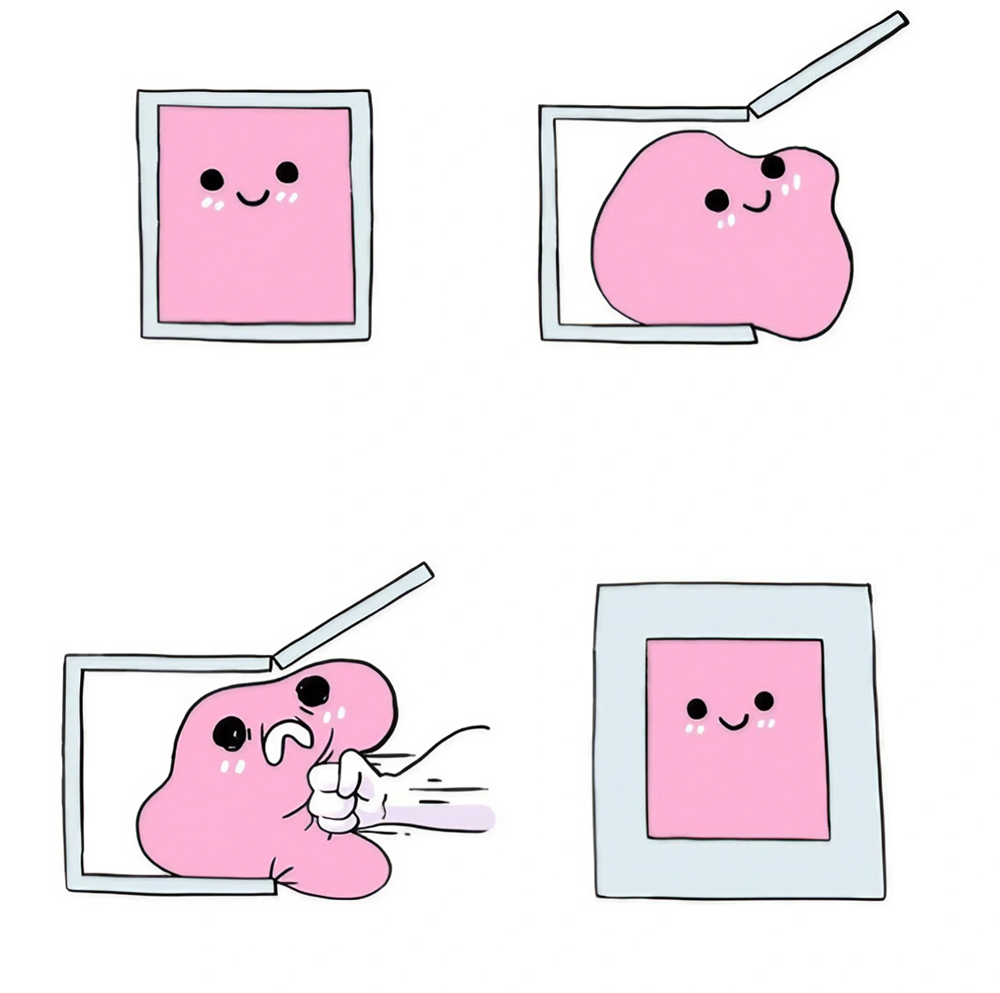
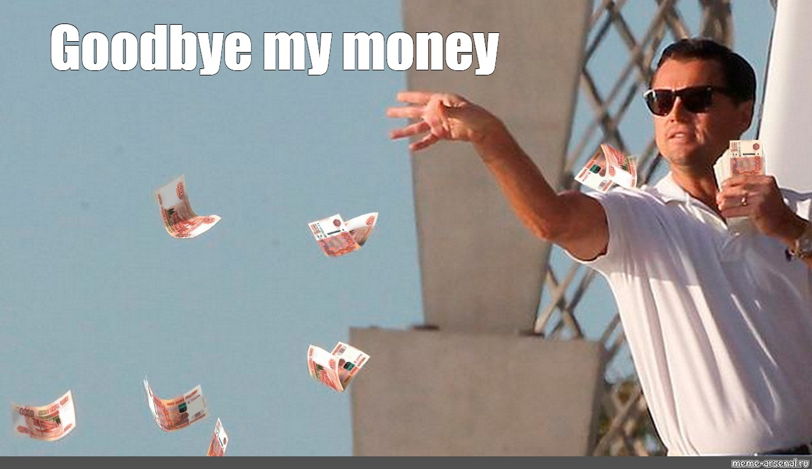

My last post was ten months ago, so it has been a while. Now I am back and in the spirit of the last post, I will try and begin to make it a habit.

## So why this long?

That's an excellent question! I am glad I asked it! Honest answer is I am not certain, life happens and time just flies. Interests come and go, and let us be honest, I have a lot of interests, or at least ambitions about what interests I want to be able to maintain. An 8-16 job, plus a lovely wife and 3 year old daughter, time is just a very valuable resource, and of course they are my priority. 

## Is there a lesson buried here?

Indeed there is! Don't have any interests, take the site down and never try and do something like this again, bye! 

Seriously though. There is. Don't overwhelm myself with things to do. Focus on one thing at a time. It's even something I have been told when I did my education in my field - Break big tasks into smaller tasks. And honestly it can be applied here as well. 

## So what is the plan genius, do you even have one?

I do!

> Egon har en plan, skide godt forfaen!

Sorry for the danish reference, but I do. I have redone the design of the blog and the website which has been giving me inspiration and motivation to start again to document my learning journey in the various things I throw myself at. 

So I decided to use the tools I have available in github, use issues and the project feature to plan blog posts. (and what I write about I need to do as well). So I am thinking to myself, that this structure might be what makes this stick this time, time will tell of course, but I am optimistic. 

## That's great and all, but when will you be back then? Next year?

No. This time I will be back this weekend, where I will show you what hobby I have taken up since the last time I posted and you will understand why I all of a sudden had no time for anything else in my spare time. I have started collecting and playing **Warhammer: Age of Sigmar**.

