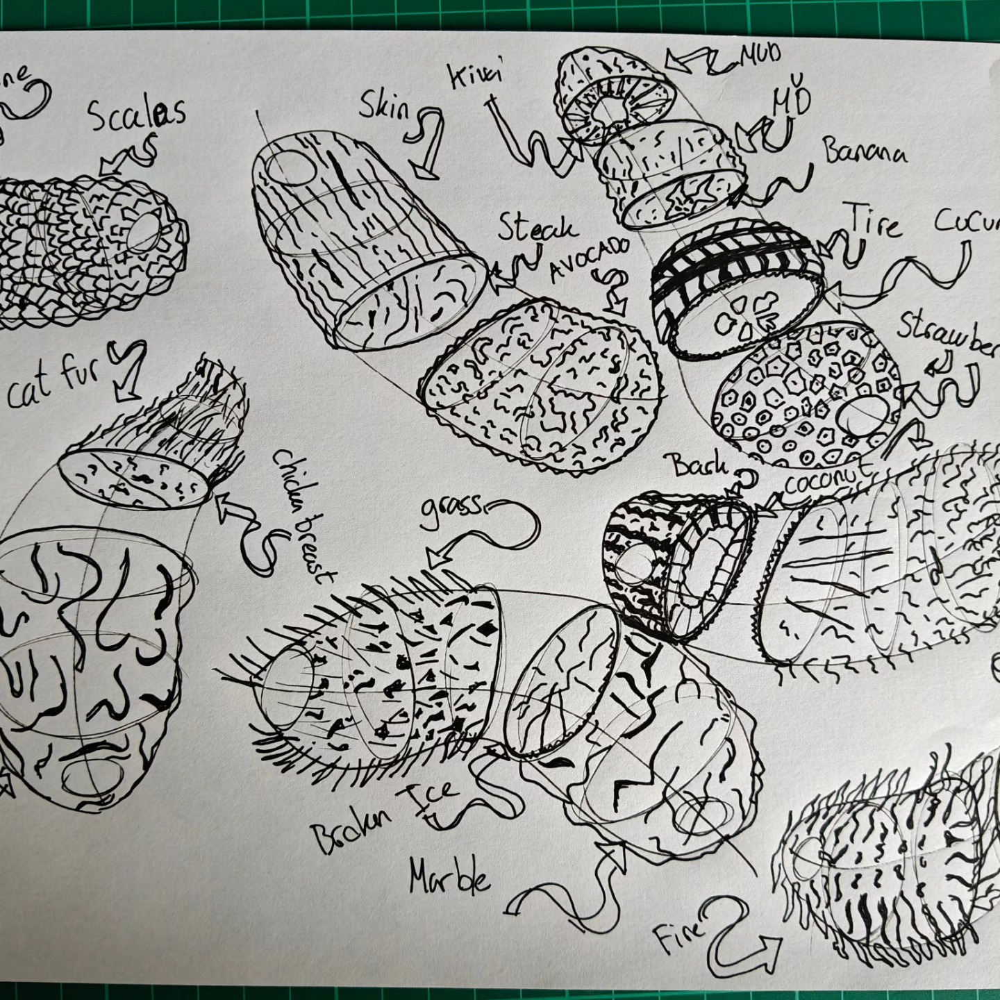
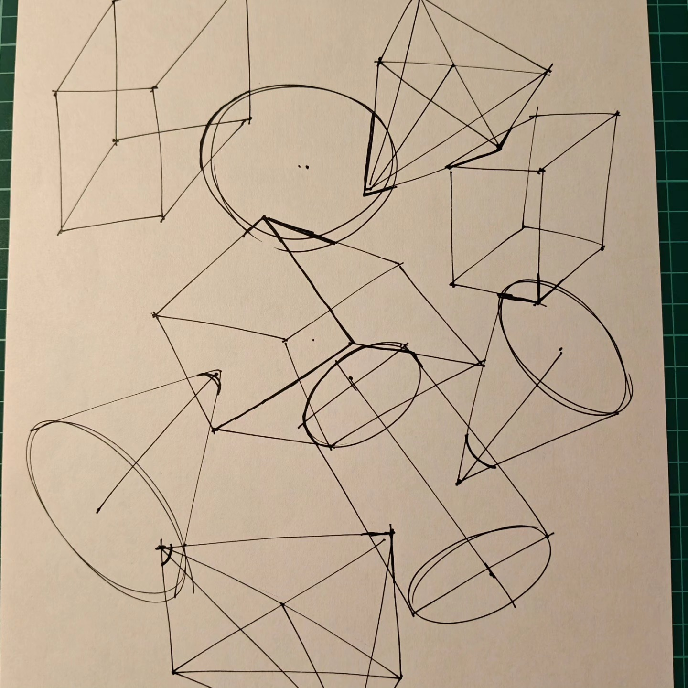

+++
date = '2025-07-10T23:48:16+02:00'
draft = false
title = 'Draw a Box Lesson 2: Complete and Reviewed!'
description = "My Draw a Box Lesson 2 completion with detailed critique from Uncomfortable"
summary = "Lesson 2 challenged my understanding but was rewarding. Got official critique from Uncomfortable himself covering organic arrows, contour lines, textures, and form intersections."
tags = ["drawing", "learning", "drawabox", "art", "lesson2"]
+++

**Lesson 2 is complete and officially marked as finished!**

Lesson two really challenged me and my understanding. A lot of the time I was wondering if what I was doing was even correct. But to be honest, after the dissecting exercise, it looked really cool, even though it wasn't entirely correct.

## My Lesson 2 Work

Here are some examples from my Lesson 2 exercises:

### Organic Intersections

### Texture Analysis and Dissection

### Form Intersections

## Official Critique

I'm on the official critique system and got one from Uncomfortable himself, which was pretty cool to be honest!

Here's the detailed critique:

### Organic Arrows

> **Great work** in executing marks that are smooth and confident - this helps to avoid the erratic widening/narrowing that can undermine the impression that our arrow structures are moving through 3D space.
>
> When it comes to the application of foreshortening to the positive space (the structure of the arrow itself), you're doing well, as you're transitioning from small to big as it gets closer to the viewer. Your application of foreshortening to the negative space however (that is, the gaps between the zigzagging sections) doesn't really appear to be given consideration. As noted here, the gaps should be compressed the further back we look in space.

### Organic Forms with Contour Lines

> I can see that you're clearly aiming to adhere to the characteristics of simple sausages, but that you're struggling with it somewhat. That's not abnormal - it can be tricky to nail initially, and I can see that you do continue to improve on this into the organic intersections - but what we're primarily looking for is whether or not students are aware of what they should be aiming for, and working towards it.
>
> Your contour ellipses and curves are being executed fairly confidently, which helps to keep them evenly shaped and gives the impression that they're wrapping around the sausage form appropriately. You're also fairly close to getting them to fit within the silhouette of the sausages, which also helps to this effect - but there is room for improvement there. Also, there are some spots where the alignment to that central minor axis line is off, so be sure to keep that in mind while working on these in the future.
>
> I did notice that the degree of your ellipses/curves seem to be pretty consistent, which isn't correct - but that's pretty common at this stage. I recommend that you review the Lesson 1 ellipses section which goes into a fair bit of depth as to how the mechanics that drive the degree of an ellipse work.

### Texture Work

> One thing to keep in mind is that the concepts we introduce relating to texture rely on skills our students generally don't have right now - because they're the skills this entire course is designed to develop. That is, spatial reasoning. Understanding how the textural forms sit on a given surface, and how they relate to the surfaces around them (which is necessary to design the shadow they would cast) is a matter of understanding 3D spatial relationships.
>
> You largely did a good job of adhering to this process of designing cast shadow shapes by first outlining them, then filling them in, in your texture analysis work, although you did tend to slip back into more one-off strokes towards the far right of the gradients, and very much leaned on them in the dissection work. That's pretty much what I see from most students at this stage, but do be sure to strive to apply that methodology throughout going forward.

### Form Intersections

> This exercise serves two main purposes:
>
> 1. **Introduces intersection lines** - Students are not expected to understand how to apply this successfully yet, but rather just make an attempt. This will continue to be developed from lessons 3-7. You started out on the right track, but I think you may have lost confidence - over time you shifted from drawing new lines for your intersections (which is closer to correct), to just reinforcing the edges that already existed.
>
> 2. **Combination of all concepts** - This exercise is essentially a combination of everything we've introduced thus far: linework, ghosting method, ellipses, perspective, foreshortening, convergence, the Y method, and so forth.
>
> You're largely doing quite well. There is room to put a bit more thought into how your boxes are constructed (applying the "negotiating of corners" from the Y method more completely), but your boxes are coming out fairly well, and your linework is leveraging the ghosting method quite effectively. 
>
> **Note**: When drawing cylinders, don't keep the side edges parallel on the page. Also, don't forget to draw through all your ellipses two full times before lifting your pen.

### Organic Intersections

> Your organic intersections are coming along pretty well, with just one point to keep in mind - the gaps we see here and here wouldn't be there, since the weight of the sausage, acted upon by gravity, would push it down to make contact with the form beneath it.
>
> **Anyway! All in all, pretty solid work. I'll go ahead and mark this lesson as complete.**

## Moving Forward to Lesson 3

Now I need to draw some plants! I gotta say, I'm pretty excited to draw something else than boxes and sausages, haha! 

The detailed feedback from this critique gives me clear direction on what to focus on as I continue my drawing journey. Even though some concepts like texture work are meant to be challenging at this stage, it's encouraging to see progress being acknowledged.

---

*Want to learn to draw too? Check out [Draw a Box](https://drawabox.com/) - it's free and incredibly well-structured!*
