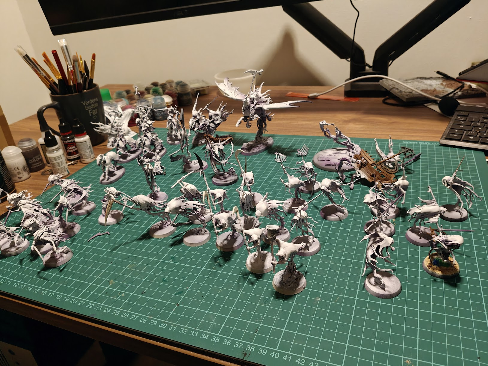
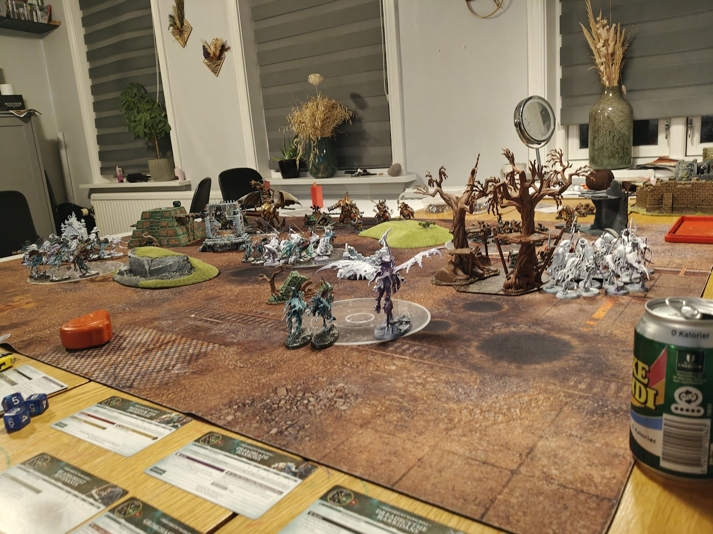
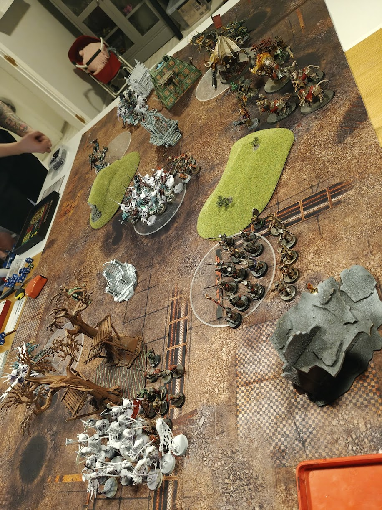

---
# ─── Required ────────────────────────────────────────────────
title: 'My First Army - And First Match of Age of Sigmar'
date: 2026-07-07T11:44:15+02:00
draft: false
description: "After playing Spearhead for a while I finally decided which faction to take to 2000 points, it was a spooky choice."
tags: ["wargaming"]
stats: ["41 models painted", "41 models primed", "Two Spearheads completed", "One 2K Army"]
---

After playing some spearhead games and learning the basics of fantasy warfare I was ready. I wanted to take the next step to play a full-size wargame of 2000 points. The army I was commanding was the Friendly Ghosts.

## From Spearhead to 2000 points
Spearhead is fun and it's easy to set up an army - it's already done for you. But I wanted to take the next step, so I needed more models. Fortunately I found a guy on Facebook who wanted to sell his Nighthaunt units and I bagged this massive roster.

I got 10 of each of the heavy infantry (Harridans, Bladegheists and Reapers), two Harrows and five Hexwraiths. 

For heroes I got Awlrach, Krulghast, Reikenor, Guardian of Souls and Lord Executioner. That's a lot of models, which meant I could assemble a 2000 point army and was ready to battle.

## My first battle
My opponent was my cousin. He had recently bought the new army at the time, Helsmiths of Hashut. The Chaos Dwarfs. We were both excited to test out our new armies against each other. I was nervous to play my first game.

My glorious ghosts on the battlefield, ready to advance into the dwarfs of chaos. I was ready. I wanted to show my strength and strategy skills.

The dwarfs set up a defensive line and I decided my hordes of ghosts should sweep over them in a glorious charge.

But it was all a ruse! My cousin's plan worked, he baited me with his chaff and gunned down my ghosts with his mighty shooters and cannons. 

My first game and first defeat. 

## Shameful display!
It was a humbling experience. My far more experienced opponent schooled me in the arts of warfare and I suffered quite a big defeat.

Nighthaunt has recently gotten themselves a new book which changed their rules quite a lot. They are no longer the aggressive charging menace, but now they are a more attrition based army. I played them as the former.

Of course as a beginner I also had no idea what a screen was - basically what my opponent did with his chaff. Screen the opponent, lure them out into the open where his shooting could benefit. And benefit it did indeed.

## Going forward
So my first game and first defeat. Will I learn from this experience? Probably a lot slower than I hope for. Next time will probably be a post composed of different games and perhaps I can sneak in a win?

