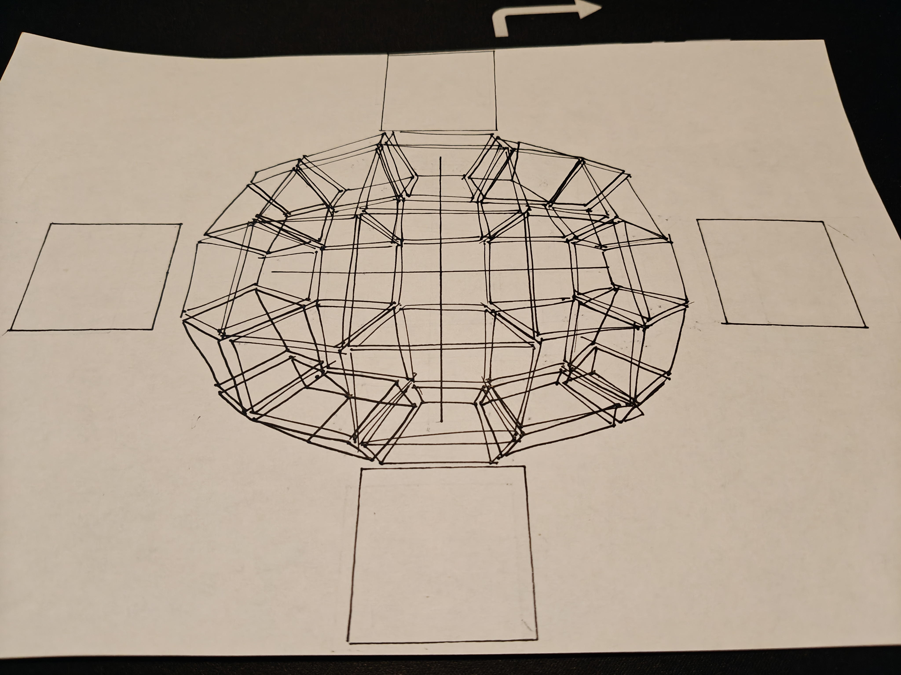

# Draw a Box: Lesson 1 Complete!

**One down, six to go! It is amazing how difficult it can actually be to draw some lines, boxes and ellipses!**

## Submitted my work for review

So I reasoned with myself, that, like writing feedback is essential to improve, and draw-a-box has this very cheap and affordable critique program that i figured, why the hell not. They are already providing me with **free** how to draw lesson, and to keep it free and support the creators I decided to take use of the critique. 

### My feedback

The feedback that I got was **amazingly good**, I half expected a > Good Job, move on.
But it was so much more. Here is my full review:

> Welcome and congratulations on finishing the first lesson of Drawabox! I'm Mada and I'll be taking a look at your submission.
>
> Overall you did a decent job here, but I do have a bit to mention so let's break them down one by one. I'll write the most important things in bold.
>
> Lines
>
> Starting with your superimposed lines, these are looking good. Ghosted lines look correctly ghosted and confident too, and there are barely any arching. You've also demonstrated the same confidence in your ghosted planes with a great accuracy. However, I noticed that you didn't put the start and end points when you bisect the planes horizontally and vertically. This results in floating lines, like this: https://imgur.com/a/Ud2O6tR. Do not forget to always plan your lines first when ghosting, even though you already kind of know where they should be.
>
>Ellipses
>
>Now with the tables of ellipses, you've demonstrated a great understanding of the concept in executing confident ellipses. However, it's better if you had varied the ellipses more in size, shape, and degrees, as the ones you've done here all look similar. There are still blank space here and there, which you can snug in with more, smaller ellipses. Please use the exercise to its utmost benefit the next time you're doing it.
>
>The ellipses in planes and funnels are nice, you drew it pretty confidently. The only problem is that you're not really hitting the sides of the planes, making them look "floating" on the page. While accuracy is indeed less important than confidence, this is the next step that you have to really use your ellipses as you want it to. Try to touch all sides of the plane and make the ellipses fit in snugly in the funnels. Remember that these goals are there for you to practice your accuracy, so do reread these parts in case you might forgot about it. Check the examples again too if you want to see how an exercise should ideally look like.
>
>https://drawabox.com/lesson/1/ellipsesinplanes/floating
>
>https://drawabox.com/lesson/1/tablesofellipses/nogoal
>
>Boxes
>
>You've shown a good understanding of how to make 2 point perspective in the plotted perspective. I did see some skewed back vertical lines here and there, which is usually caused by an accumulation of human error as you plot more and more lines. I assume that's the case and you understand that every vertical line is straight in 2 point perspective. Even if the points are not aligned correctly, try to find a middle ground and draw it as vertical as you can.
>
>You've applied the ghosting method and lines extension correctly for the rough perspective. I've noticed that some of the back faces of your boxes are not rectangular. By rectangular, we mean that they should be composed of horizontals that are parallel to the horizon line, and verticals that are perpendicular to it. While this could also be caused by the sometimes inaccurate lines, it's worth mentioning that there should not be any arbitrary guesswork or random angles. Don't forget that these rectangular front/back faces are the unique characteristics of 1 point perspective. (https://drawabox.com/lesson/1/20/guessing) Also try to use a colored pen for the line extensions next time, so you can differ it from your original line and analyze your mistake effectively. This is important as you will do this a lot in the box challenge, and that's how you'll truly improve with them.
>
>You've done a great job at doing the rotated boxes so far. You've rotated them pretty well (while making sure to move the converging lines) and used neighboring elements to deduce the next orientation of boxes, which is the whole purpose of this exercise. Unfortunately, you haven't drawn in the boxes at each corner (you're missing 12 boxes to be exact; refer to the example here: https://drawabox.com/lesson/1/21/example). We'd like you to finish each exercise to its utmost completion and benefit, especially because the boxes at the corner give you the most challenge and will start making you think how to rotate a box in the 3D space.
>
>Finally, organic perspective looks great as well. They look like they belong in the same page and the lines converge as they move farther away from the viewer. There are a few hiccups here and there where there are divergences that results in skewed boxes, but it's expected at this point. Like your tables of ellipses, try to vary your size, shape, and rotation of your boxes more in this exercise. This will further increase your repertoire of boxes, and in turn makes it easier for you to rotate them in your head, which is the ultimate goal for all these boxes you've been making.
>
>This will get more relevant as you get to the box challenge, but if you choose to do so, any hatching from this point on should also be done with the ghosting method. It will make your stuff cleaner and more practice is always good! Try to cover the whole area of the box with consistent spacing.
>
>While I think you've grasped most of the concepts, I'd still like you to finish the rotated boxes first before moving on. Try to apply what we've talked so far and remember to prioritize confidence over accuracy in your ghosting. Once you're done with it, you'll be able to move on to the box challenge!

Can you see what I mean? So thorough and to the points as well. I did what Mada asked and redid the Rotated Boxes exercise.

 It got accepted and now I will prepare for the 250 boxes challenge!
