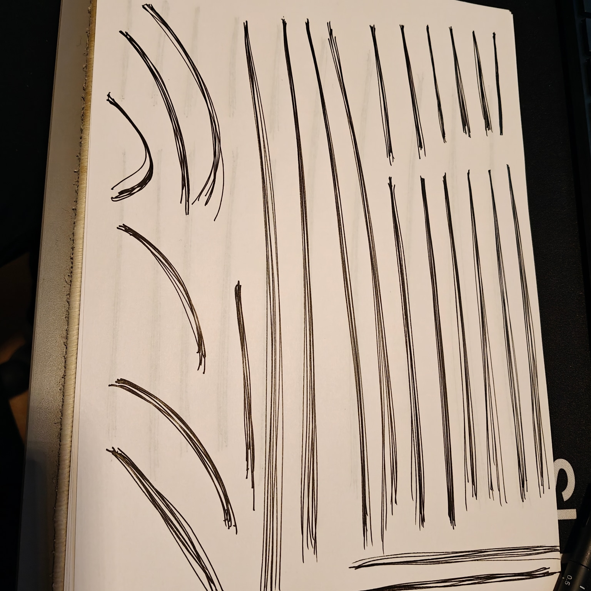
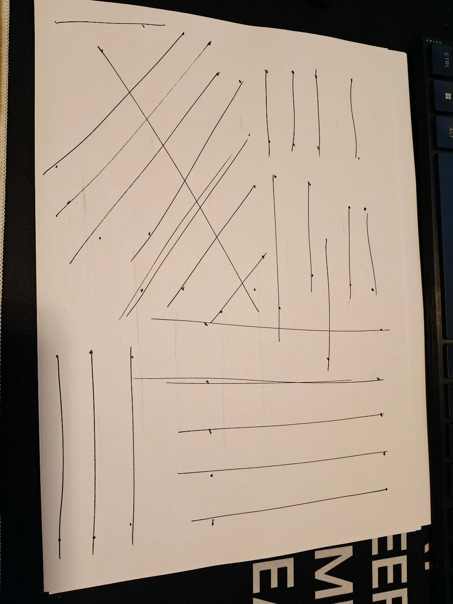
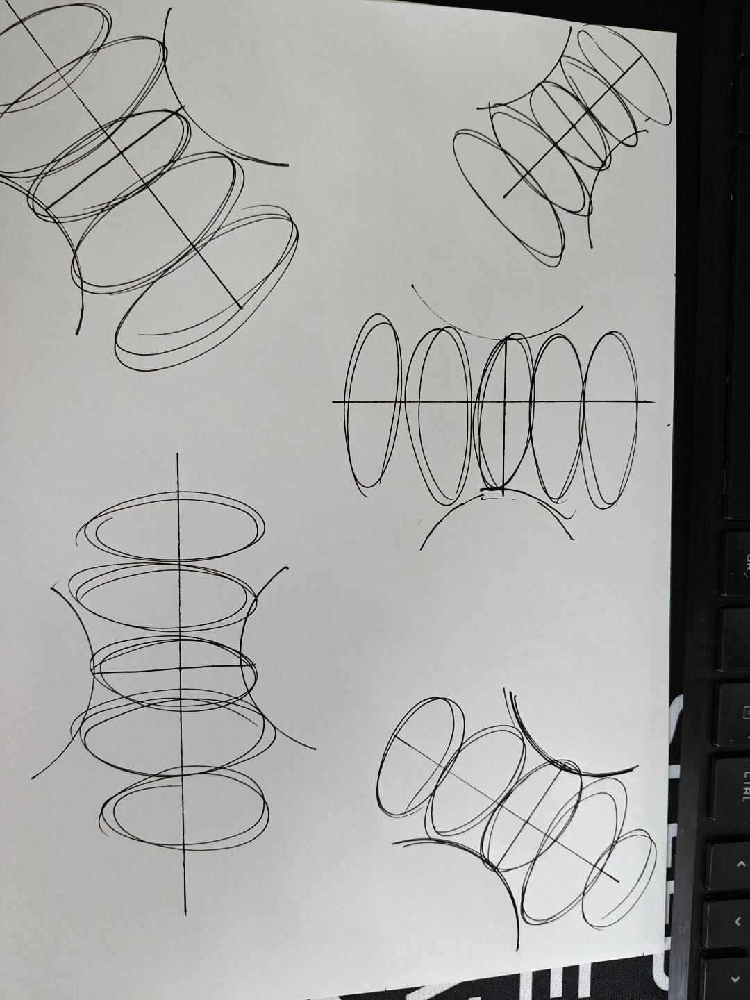
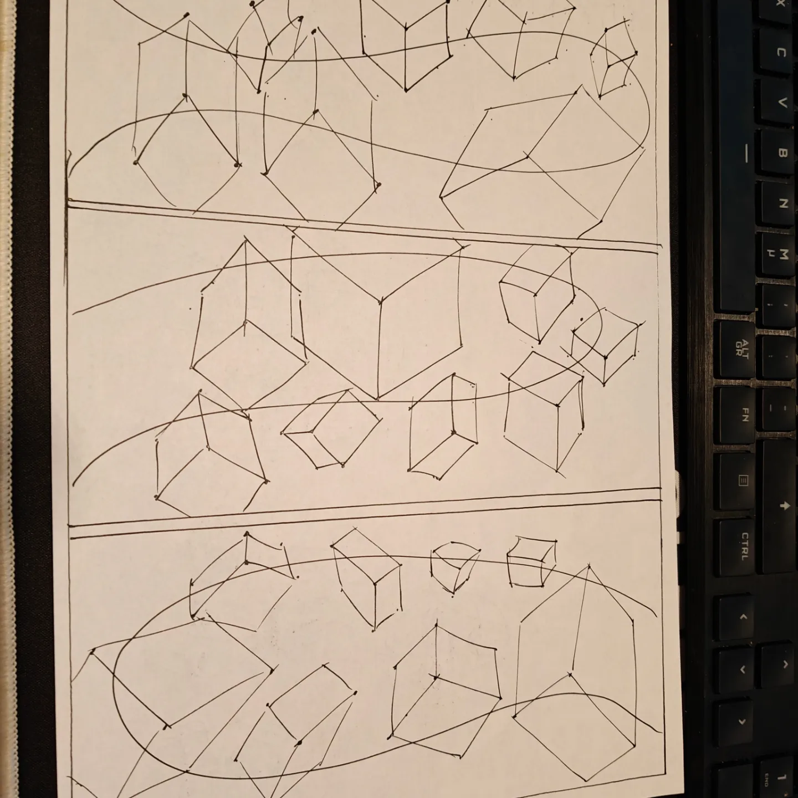

# Draw a Box: My First Steps into Drawing

**One of the skills I've decided to develop is drawing. While I could simply sit down and start drawing - which would certainly be better than doing nothing - I realized that figuring out all the drawing concepts on my own would be an unnecessarily long and time-consuming process.**

After searching for structured learning resources, I discovered [Draw a Box](https://drawabox.com/), a comprehensive program for learning the fundamentals of drawing.

## Current Progress: Lesson One

I'm currently working through Lesson One, gradually approaching the infamous 250 boxes challenge. Here's what I've completed so far:

### Lines Homework

### Ellipses Practice

### Box Construction

## Initial Reflections
Even at this early stage, I can already feel improvements in my drawing skills. The ghosting method, in particular, has helped me draw with more confidence. While my lines might not be perfect yet, they're noticeably better than when I started - and that's what progress is all about!

*Follow along with my drawing journey as I continue to practice and improve.*
